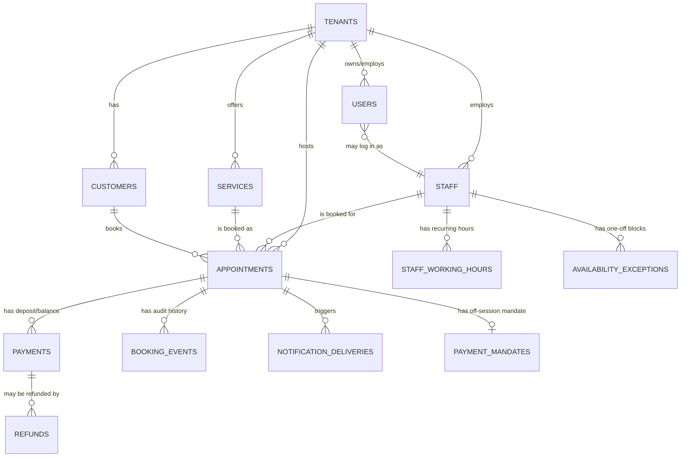
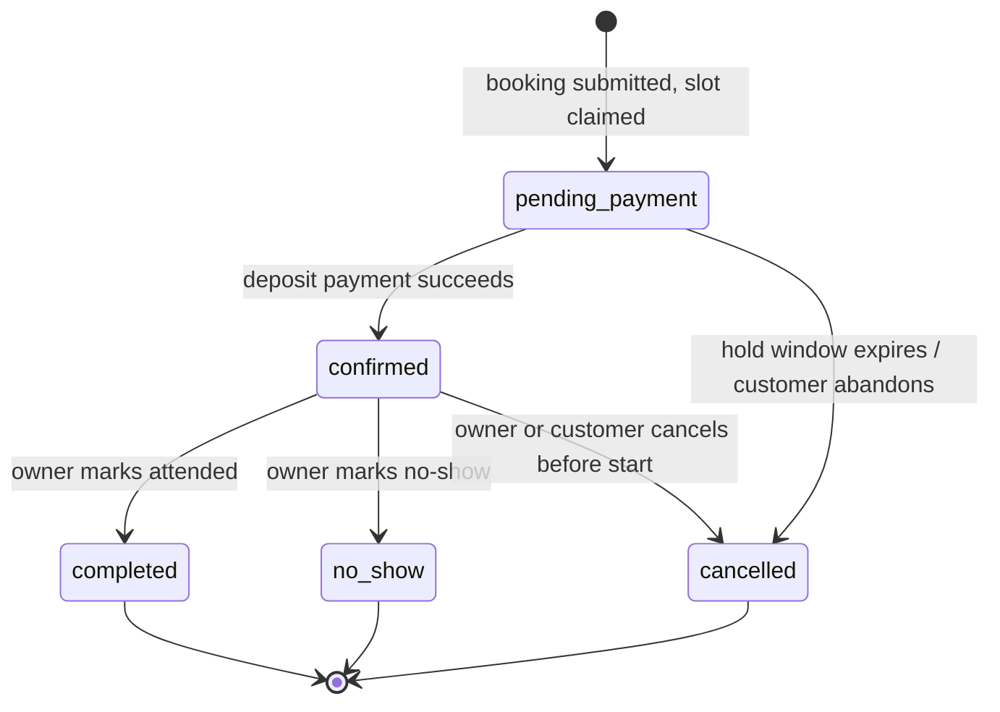
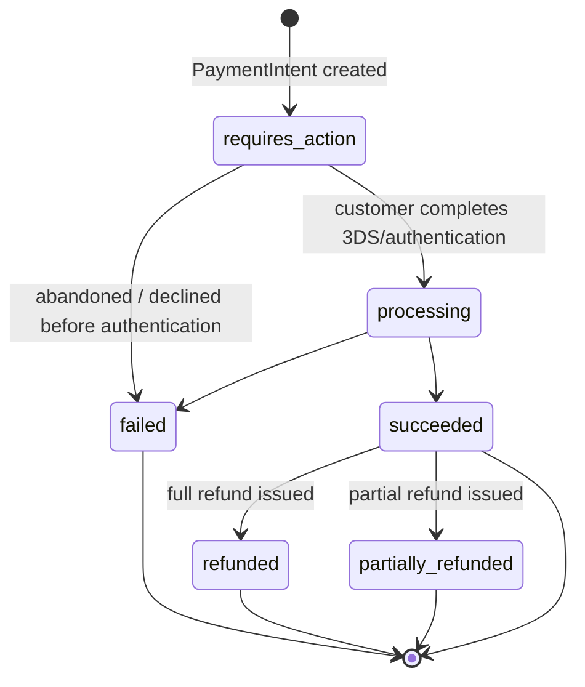

# Data Model
> Purpose: the authoritative description of stored data.
> Project: bookslot (PRIVATE track)
> Last updated: 2026-08-24 (Session 4 — D-0008's DDL corrected after execution testing; see amendment note near the `appointments` table; amended Session 5 — buffer made a required field on `services`, hold window and mandate-field open items closed; amended Session 7 — `payment_mandates` erasure carve-out specified (D-0022), `notification_deliveries.purpose` gains `rebooking_invite` (D-0023), buffer before/after scope settled (D-0024, no schema change); amended Session 8 — RLS policy comparison hardened with `NULLIF` after execution testing found the tenancy-boundary section's fail-closed claim was incomplete (D-0025); Laravel migrations translating this DDL now exist, no longer future-session work)

This supersedes Session 0/1's stub. It implements the direction that stub
recorded, resolved with the specifics decided in `09-decision-log.md`
(D-0005 tenant isolation, D-0006 deposit mechanics, D-0007 double-booking
constraint) and driven by `02-requirements.md`'s journeys. Types are written
as PostgreSQL DDL fragments for precision; the actual Laravel migrations are
future-session work, not produced here per this session's constraints.

## Entity-relationship diagram



**Amendment (Session 3, 2026-08-24) — `PAYMENT_MANDATES` added per D-0010.** Not present in the original Session 2 ERD; see the new table definition below and `09-decision-log.md` D-0010.

`USERS` is deliberately separate from `STAFF`: a staff/resource profile
(the bookable thing an appointment references) must be able to exist before
that person has set up dashboard login credentials — an owner adding a new
artist to the calendar shouldn't be blocked on that artist creating an
account first.

## Tenancy boundary (applies to every table marked "tenant-scoped" below)

Per D-0005: every tenant-scoped table has a `tenant_id uuid NOT NULL
REFERENCES tenants(id)`. Enforcement is two layers, applied consistently:

1. A Laravel global scope on every corresponding Eloquent model, filtering
   on the authenticated request's tenant.
2. A Postgres RLS policy per tenant-scoped table:

```sql
ALTER TABLE <table> ENABLE ROW LEVEL SECURITY;
ALTER TABLE <table> FORCE ROW LEVEL SECURITY;
CREATE POLICY tenant_isolation ON <table>
  USING (tenant_id = current_setting('app.current_tenant_id', true)::uuid);
```

`current_setting(..., true)` returns `NULL` rather than erroring when unset,
so an unset tenant context yields zero matching rows (fail closed) rather
than an exception that might be mishandled into fail-open. `users` (for
platform admins) and `tenants` itself are not tenant-scoped in this sense —
`tenants` is the boundary, not inside it.

**Amendment (Session 3, 2026-08-24) — GUC lifecycle fully specified, D-0009.**
The line above ("the app sets `SET app.current_tenant_id`...") was
underspecified: a plain session-level `SET` is unsafe on a pooled or
long-lived connection (Horizon workers, PgBouncer), since it persists past
the current unit of work for whoever reuses that connection next. The
mechanism is now: `set_config('app.current_tenant_id', ?, true)` (a
parameterized call, never a string-interpolated `SET LOCAL`), issued as the
first statement inside an explicitly opened transaction, for every
tenant-scoped HTTP request and every queued job — the transaction boundary
is what makes the GUC's reset unconditional. Full detail — roles, the
platform-admin path (which revises this file's and D-0005's original
`BYPASSRLS`-for-admin phrasing), queue-job/retry/batch behavior, and the
unauthenticated public-booking path — is in `09-decision-log.md` D-0009 and
`07-testing-strategy.md`'s tenant-isolation suite, not repeated here.

**Amendment (Session 8, 2026-08-24) — the fail-closed comparison hardened
with `NULLIF`, D-0025.** Execution testing against real Postgres 17.11 found
that the "`current_setting(..., true)` returns `NULL` rather than erroring
when unset" claim two paragraphs above is only true for a connection that
has *never* called `set_config()` for this GUC. Once any transaction on a
physical connection has set it — even once, even committed — the custom GUC
is permanently defined for that connection's remaining session lifetime:
every later transaction that doesn't set it gets `current_setting(..., true)
= ''` (empty string), not `NULL`. Casting `''::uuid` raises `SQLSTATE 22P02`
rather than comparing as `NULL` — under this project's own chosen PgBouncer
transaction-mode pooling (`08-deployment-and-operations.md`), that's the
normal state on every backend connection after its first tenant-scoped
transaction, not a rare cold-start edge case. The corrected policy, now what
every table below actually implements:

```sql
ALTER TABLE <table> ENABLE ROW LEVEL SECURITY;
ALTER TABLE <table> FORCE ROW LEVEL SECURITY;
CREATE POLICY tenant_isolation ON <table>
  USING (tenant_id = NULLIF(current_setting('app.current_tenant_id', true), '')::uuid);
```

This restores the documented fail-closed-to-zero-rows behavior for real,
rather than an unhandled exception. Full findings, the options considered,
and why this is a hardening rather than a design reversal: `09-decision-
log.md` D-0025. This does **not** change `set_config()`'s own call pattern
(still parameterized, still `is_local = true`, still the first statement in
an explicit transaction) — only the read-side comparison.

## Tables

### `tenants`

| Column | Type | Null | Default | Notes |
|---|---|---|---|---|
| id | uuid | no | `gen_random_uuid()` | |
| name | text | no | | Studio's display name |
| slug | text | no | | Unique, used in the public booking page path |
| timezone | text | no | | IANA zone, e.g. `America/Toronto` — studio-level minimum per this session's scope |
| currency | char(3) | no | | ISO 4217, e.g. `usd`. Single currency per tenant at MVP (multi-currency is a non-goal per `01`), but stored per-tenant now so it isn't a painful migration later |
| stripe_connect_account_id | text | yes | null | Set once Connect onboarding completes |
| stripe_onboarding_status | text | no | `'not_started'` | `not_started, pending, complete, restricted` |
| deleted_at | timestamptz | yes | null | Soft delete — see Soft/hard delete matrix |
| created_at, updated_at | timestamptz | no | `now()` | |

- Unique: `slug`.
- Indexes: `slug` (for public page lookup), partial index `WHERE deleted_at IS NULL` for active-tenant queries.

### `users` (login identities: owners, staff logins, platform admins)

| Column | Type | Null | Default | Notes |
|---|---|---|---|---|
| id | uuid | no | `gen_random_uuid()` | |
| tenant_id | uuid | yes | null | **Null for platform admins only** — everyone else must have one |
| role | text | no | | `owner, staff, platform_admin` (CHECK constraint) |
| name | text | no | | |
| email | text | no | | |
| password_hash | text | no | | |
| email_verified_at | timestamptz | yes | null | |
| deleted_at | timestamptz | yes | null | |
| created_at, updated_at | timestamptz | no | `now()` | |

- Unique: `(tenant_id, email)` — a `platform_admin` row has `tenant_id NULL`,
  so platform admin emails are globally unique via a second partial unique
  index `email WHERE tenant_id IS NULL`.
- CHECK: `role = 'platform_admin' OR tenant_id IS NOT NULL`.
- Tenant-scoped for `role IN ('owner','staff')`; RLS policy on this table
  must additionally allow `role = 'platform_admin'` rows to be visible to the
  admin path regardless of `app.current_tenant_id` — see the platform-admin
  bypass note under Tenancy boundary above.

### `staff` (the bookable resource — `resource_id` in the exclusion constraint)

| Column | Type | Null | Default | Notes |
|---|---|---|---|---|
| id | uuid | no | `gen_random_uuid()` | |
| tenant_id | uuid | no | | Tenant-scoped |
| user_id | uuid | yes | null | `REFERENCES users(id) ON DELETE SET NULL` — nullable because a staff profile can be bookable before it has a login |
| display_name | text | no | | |
| is_active | boolean | no | `true` | A departed artist is deactivated, not deleted — see matrix |
| deleted_at | timestamptz | yes | null | |
| created_at, updated_at | timestamptz | no | `now()` | |

- Index: `(tenant_id, is_active)` for the owner dashboard's active-staff list.

### `services`

| Column | Type | Null | Default | Notes |
|---|---|---|---|---|
| id | uuid | no | `gen_random_uuid()` | |
| tenant_id | uuid | no | | |
| name | text | no | | |
| duration_minutes | integer | no | | CHECK `> 0` |
| price_amount | integer | no | | Minor units (cents) |
| currency | char(3) | no | | Mirrors `tenants.currency` at MVP |
| deposit_type | text | no | | `fixed` or `percentage` (CHECK) |
| deposit_fixed_amount | integer | yes | null | Minor units; set iff `deposit_type = 'fixed'` |
| deposit_percentage_bps | integer | yes | null | Basis points (e.g. `2000` = 20%); set iff `deposit_type = 'percentage'` |
| buffer_before_minutes | integer | no | **none — required** | **Added Session 5, D-0012.** No default: the owner must set this explicitly when creating the service. Snapshotted onto each `appointments` row at booking-creation time (D-0008) — this column is the configuration source that snapshot was always meant to read from, which was missing until this session. `CHECK (buffer_before_minutes >= 0 AND buffer_before_minutes <= 1440)` |
| buffer_after_minutes | integer | no | **none — required** | Same rule as above. `CHECK (buffer_after_minutes >= 0 AND buffer_after_minutes <= 1440)` |
| is_active | boolean | no | `true` | |
| deleted_at | timestamptz | yes | null | |
| created_at, updated_at | timestamptz | no | `now()` | |

- CHECK: exactly one of `deposit_fixed_amount`/`deposit_percentage_bps` is
  non-null, matching `deposit_type`.
- Index: `(tenant_id, is_active)` for the public booking page's service list.
- **No default on either buffer column, deliberately (D-0012):** an `INSERT`
  that omits either value fails rather than silently defaulting to zero
  back-to-back scheduling. This does not decide whether MVP restricts buffer
  to "after only" or allows both — that stays open (see Open questions) — a
  studio may set either to `0` explicitly if it wants zero turnaround for a
  given service; the point is that this is now always a deliberate choice,
  never an inattentive omission.

### `customers`

| Column | Type | Null | Default | Notes |
|---|---|---|---|---|
| id | uuid | no | `gen_random_uuid()` | |
| tenant_id | uuid | no | | A customer record is per-tenant, not shared across studios, even if the same person books two different studios |
| name | text | no | | |
| email | text | no | | |
| phone | text | yes | null | |
| notes | text | yes | null | Owner-facing free text |
| erasure_requested_at | timestamptz | yes | null | Set when FR-18 erasure is actioned; drives anonymization, not row deletion |
| created_at, updated_at | timestamptz | no | `now()` | |

- Unique: `(tenant_id, email)` — used to match a returning customer during
  booking (FR-02's journey creates-or-matches by this key).
- No `deleted_at` — see Soft/hard delete matrix; erasure anonymizes in place.

### `staff_working_hours` (recurring weekly availability)

| Column | Type | Null | Default | Notes |
|---|---|---|---|---|
| id | uuid | no | `gen_random_uuid()` | |
| tenant_id | uuid | no | | |
| staff_id | uuid | no | `REFERENCES staff(id) ON DELETE RESTRICT` | |
| day_of_week | smallint | no | | `0`–`6`, CHECK range |
| start_time | time | no | | Studio-local wall-clock time, no date |
| end_time | time | no | | CHECK `end_time > start_time` |
| created_at, updated_at | timestamptz | no | `now()` | |

- Index: `(tenant_id, staff_id, day_of_week)`.
- These rows are interpreted against `tenants.timezone` fresh at
  slot-computation time — see Timezone strategy below. This is *why*
  recurring rules survive DST without special-casing: the rule is never
  pre-converted to a fixed UTC offset and stored that way.

### `availability_exceptions` (one-off blocks, holidays, and one-off extra availability)

| Column | Type | Null | Default | Notes |
|---|---|---|---|---|
| id | uuid | no | `gen_random_uuid()` | |
| tenant_id | uuid | no | | |
| staff_id | uuid | yes | `REFERENCES staff(id) ON DELETE RESTRICT` | Null = applies studio-wide (e.g. a studio holiday) |
| date | date | no | | Studio-local calendar date |
| is_available | boolean | no | | `false` = blocked/holiday; `true` = one-off extra availability outside normal working hours |
| start_time | time | yes | null | Null = all day |
| end_time | time | yes | null | |
| reason | text | yes | null | |
| created_at, updated_at | timestamptz | no | `now()` | |

- Index: `(tenant_id, staff_id, date)`.

### `appointments` (the core table)

| Column | Type | Null | Default | Notes |
|---|---|---|---|---|
| id | uuid | no | `gen_random_uuid()` | |
| tenant_id | uuid | no | | |
| staff_id | uuid | no | `REFERENCES staff(id) ON DELETE RESTRICT` | This is the exclusion constraint's `resource_id` |
| service_id | uuid | no | `REFERENCES services(id) ON DELETE RESTRICT` | |
| customer_id | uuid | no | `REFERENCES customers(id) ON DELETE RESTRICT` | |
| appointment_range | tstzrange | no | | See D-0007 for bounds convention and DST handling. Customer-facing — this is the literal window shown on confirmations, calendar exports, and the dashboard; buffer is never mixed into it |
| starts_at | timestamptz | no | `GENERATED ALWAYS AS (lower(appointment_range)) STORED` | Convenience column for readable queries/indexing |
| ends_at | timestamptz | no | `GENERATED ALWAYS AS (upper(appointment_range)) STORED` | |
| buffer_before_minutes | integer | no | **none, as of Session 5 — see below** | **Added Session 3, D-0008; `DEFAULT 0` removed Session 5, D-0012.** Snapshotted from the service's (now-required, D-0012) buffer configuration at booking-creation time — never looked up live, so a later buffer-config change never retroactively alters an existing booking. Always populated explicitly by application code, never by column default. `CHECK (buffer_before_minutes >= 0 AND buffer_before_minutes <= 1440)` — see amendment below |
| buffer_after_minutes | integer | no | **none, as of Session 5** | Same snapshotting rule and CHECK bounds as above |
| occupancy_range | tstzrange | no | `GENERATED ALWAYS AS (occupancy_window(appointment_range, buffer_before_minutes, buffer_after_minutes)) STORED` | **Added Session 3, D-0008; expression corrected Session 4 — see amendment below.** The buffered window the exclusion constraint actually checks. Not customer-facing |
| status | text | no | `'pending_payment'` | See Booking state machine below |
| cancelled_by | text | yes | null | `customer, studio, system` — set only when `status = 'cancelled'` |
| cancelled_reason | text | yes | null | |
| cancelled_at | timestamptz | yes | null | |
| notes | text | yes | null | Owner-facing |
| created_at, updated_at | timestamptz | no | `now()` | |

- **No `deleted_at`** on this table — see Soft/hard delete matrix. A
  released slot is represented by `status`, not deletion.
- CHECK: `lower(appointment_range) < upper(appointment_range)`.
- CHECK: `status IN ('pending_payment','confirmed','completed','no_show','cancelled')`.
- CHECK: `(status = 'cancelled') = (cancelled_by IS NOT NULL)`.
- CHECK: `buffer_before_minutes >= 0 AND buffer_before_minutes <= 1440` (and the
  same for `buffer_after_minutes`) — see amendment below for why both bounds
  are load-bearing, not defensive filler.
- CHECK: `occupancy_range @> appointment_range` — the containment invariant
  directly; see amendment below.
- Exclusion constraint (D-0007, added in its own migration after `btree_gist`
  exists; **checked against `occupancy_range`, not `appointment_range`, per
  the Session 3 amendment D-0008** — see that decision for why a second,
  generated range was needed rather than checking the literal window):

```sql
ALTER TABLE appointments
  ADD CONSTRAINT no_overlapping_appointments
  EXCLUDE USING gist (
    tenant_id WITH =,
    staff_id WITH =,
    occupancy_range WITH &&
  ) WHERE (status NOT IN ('cancelled', 'no_show') AND status IS NOT NULL);
```

### Amendment (Session 4, 2026-08-24) — D-0008's generated column corrected after execution testing

Session 3's `occupancy_range` expression (direct `tstzrange(lower(...) -
(buffer_before_minutes || ' minutes')::interval, ...)` inline in
`GENERATED ALWAYS AS`) was written but never executed. Running it against
PostgreSQL 17.11 fails with `ERROR: generation expression is not immutable`
(`SQLSTATE 42P17`) — Postgres cannot prove the `integer || text` → `::interval`
cast chain is immutable, even though it is in this case. Full execution
results, the options considered (trigger-maintained column; the function
form chosen here; application-layer population), and the version-floor and
`search_path`-hardening reasoning below are in `09-decision-log.md`'s D-0008
amendment — not repeated in full here. This section carries the corrected,
authoritative DDL only.

**Corrected DDL, in the order it must run** (extension → function → table →
constraints; see the Migration order amendment below for where each step
sits relative to the rest of the schema):

```sql
CREATE EXTENSION IF NOT EXISTS btree_gist;

CREATE FUNCTION occupancy_window(
  appt tstzrange,
  buf_before integer,
  buf_after integer
) RETURNS tstzrange
LANGUAGE sql
IMMUTABLE PARALLEL SAFE
SET search_path = pg_catalog, pg_temp
AS $$
  SELECT tstzrange(
    lower(appt) - make_interval(mins => buf_before),
    upper(appt) + make_interval(mins => buf_after),
    '[)'
  )
$$;

-- appointments: buffer/occupancy columns and their constraints
-- (shown here in isolation; the full table also carries every other
-- column and CHECK listed earlier in this section)
-- NOTE (Session 5, D-0012): DEFAULT 0 removed — buffer is always populated
-- explicitly from the (now-required, no-default) services.buffer_*_minutes
-- configuration at booking-creation time, never by column default.
  buffer_before_minutes integer NOT NULL
    CONSTRAINT appointments_buffer_before_nonneg CHECK (buffer_before_minutes >= 0)
    CONSTRAINT appointments_buffer_before_max CHECK (buffer_before_minutes <= 1440),
  buffer_after_minutes integer NOT NULL
    CONSTRAINT appointments_buffer_after_nonneg CHECK (buffer_after_minutes >= 0)
    CONSTRAINT appointments_buffer_after_max CHECK (buffer_after_minutes <= 1440),
  occupancy_range tstzrange GENERATED ALWAYS AS (
    occupancy_window(appointment_range, buffer_before_minutes, buffer_after_minutes)
  ) STORED,
  ...
  CONSTRAINT appointments_occupancy_contains_appt
    CHECK (occupancy_range @> appointment_range)

-- added as its own later migration, once btree_gist is confirmed present:
ALTER TABLE appointments
  ADD CONSTRAINT no_overlapping_appointments
  EXCLUDE USING gist (
    tenant_id WITH =,
    staff_id WITH =,
    occupancy_range WITH &&
  ) WHERE (status NOT IN ('cancelled', 'no_show') AND status IS NOT NULL);
```

**The `SET search_path = pg_catalog, pg_temp` clause is inline in
`CREATE FUNCTION` itself, not applied afterward via `ALTER FUNCTION`** —
confirmed by execution (`09` D-0008 amendment, V2) to be accepted and to
behave identically to the previously-demonstrated `ALTER FUNCTION` form
under a hostile `search_path` that explicitly repositions `pg_catalog`.
This closes the one window where an earlier, ALTER-based fix could have
left the function briefly deployed unhardened between its `CREATE` and the
follow-up `ALTER`.

**Why the containment CHECK is redundant today, and kept anyway.** With
both buffer columns bounded to `[0, 1440]`, `occupancy_range` can never be
narrower than `appointment_range` (ruled out by the `>= 0` bound — the
non-inverting case an unbounded-below buffer would otherwise allow, proven
in `09`'s V1) and can never explode to an absurd width (ruled out by the
`<= 1440` bound). Given those two CHECKs, `occupancy_range @> appointment_range`
already holds by construction — it adds no case the buffer CHECKs don't
already prevent *today*. It stays in the schema anyway because it states
the actual invariant this table depends on (the exclusion constraint must
never check a window narrower than the real appointment) directly, rather
than as a proxy inferred from two unrelated-looking bounds on two integer
columns. If a future change ever alters how `occupancy_range` is computed,
or changes the buffer bounds rule, the containment CHECK keeps enforcing
the property that actually matters without needing to be re-derived and
re-verified against whatever the buffer bounds happen to be at that time.

- Indexes: `(tenant_id, staff_id, starts_at)` for the owner's calendar view;
  `(tenant_id, customer_id)` for a customer's booking history; a GIST index
  on `occupancy_range` is created implicitly by the exclusion constraint
  itself. Slot-availability range queries against the literal window use
  `appointment_range` directly (a separate index, since it's no longer the
  constraint's own GIST index).

### `payments`

| Column | Type | Null | Default | Notes |
|---|---|---|---|---|
| id | uuid | no | `gen_random_uuid()` | |
| tenant_id | uuid | no | | |
| appointment_id | uuid | no | `REFERENCES appointments(id) ON DELETE RESTRICT` | |
| type | text | no | | `deposit, balance` (CHECK) |
| stripe_payment_intent_id | text | no | | |
| stripe_charge_id | text | yes | null | |
| amount | integer | no | | Minor units |
| currency | char(3) | no | | |
| application_fee_amount | integer | yes | null | Platform's cut, minor units |
| status | text | no | | See Payment state machine below |
| failure_code | text | yes | null | Stripe decline/error code, for owner-facing messaging and dispute evidence |
| created_at, updated_at | timestamptz | no | `now()` | |

- Unique: `stripe_payment_intent_id`.
- Index: `(tenant_id, appointment_id, type)` — the query FR-15's dashboard
  and J5/J6's balance logic both run ("what's this appointment's deposit/
  balance status").
- Never deleted — financial/audit record, see matrix.

### `refunds`

| Column | Type | Null | Default | Notes |
|---|---|---|---|---|
| id | uuid | no | `gen_random_uuid()` | |
| tenant_id | uuid | no | | |
| payment_id | uuid | no | `REFERENCES payments(id) ON DELETE RESTRICT` | |
| stripe_refund_id | text | no | | |
| amount | integer | no | | Minor units; may be partial |
| reason | text | yes | null | |
| status | text | no | | `pending, succeeded, failed` |
| created_at, updated_at | timestamptz | no | `now()` | |

- Unique: `stripe_refund_id`.
- Index: `(tenant_id, payment_id)`.

### `payment_mandates` (off-session balance-charge consent evidence — added Session 3, D-0010)

| Column | Type | Null | Default | Notes |
|---|---|---|---|---|
| id | uuid | no | `gen_random_uuid()` | |
| tenant_id | uuid | no | | |
| appointment_id | uuid | no | `REFERENCES appointments(id) ON DELETE RESTRICT` | One per appointment, created at booking submission alongside the deposit PaymentIntent |
| mandate_text | text | no | | The full rendered text the customer agreed to — a snapshot, not a template reference. This is deliberately duplicated content (not just a version pointer) so a dispute months later doesn't depend on template history being preserved |
| mandate_template_version | text | no | | Identifies which template produced `mandate_text`, for change-tracking only |
| balance_amount_disclosed | integer | no | | Minor units — the exact remaining-balance figure disclosed at booking time |
| accepted_at | timestamptz | no | | |
| accepted_ip | inet | no | | |
| accepted_user_agent | text | yes | null | |
| stripe_payment_intent_id | text | no | | The deposit PaymentIntent this mandate covers |
| stripe_payment_method_id | text | **yes** | null | The saved payment method the later off-session balance charge (J5) will target. **Nullable per D-0031 (Session 10)** — see the amendment below; not known at mandate-insert time, backfilled once a payment method is actually attached |
| created_at | timestamptz | no | `now()` | |

- Unique: `appointment_id`.
- A `booking_events` row (`event_type = 'mandate_accepted'`, `metadata`
  referencing this row's `id`) links this into the same audit trail as
  `stripe_webhook_events.payload`, so dispute evidence can be assembled from
  `booking_events` + `payment_mandates` + `stripe_webhook_events` together.
- Never deleted — dispute evidence, same reasoning as `payments`/`refunds`.
- **Erasure carve-out (added Session 7, D-0022):** a customer erasure
  (FR-18) never modifies or deletes a `payment_mandates` row — every
  column, including `accepted_ip` and `accepted_user_agent`, survives
  exactly as recorded at accept-time. This table has no directly
  customer-identifying column in the first place (no `customer_id`, no
  name/email/phone — it links only via `appointment_id`); the actual
  identifying fields erasure nulls are on `customers` (see that table's row
  in the Soft delete matrix below, unchanged by this note).
  `accepted_ip`/`accepted_user_agent` are classified as **evidentiary, not
  identifying**: their only retained value is corroborating, at a future
  Stripe dispute, that the accept-time request came from a plausible,
  consistent session/device/geography — a forensic, dispute-defense
  purpose distinct from `customers.name`/`email`/`phone`'s sole purpose of
  identifying/contacting the person. This is a deliberate carve-out from
  `06-security-threat-model.md`'s general erasure handling on a
  legal-claims basis (mandates are dispute evidence; erasing them would
  destroy the ability to defend a chargeback for a transaction that
  legitimately occurred), not a conflict with it — see `06`'s Session 7
  amendment and `09-decision-log.md` D-0022 for the full reasoning.
- Covers only the J5 off-session balance charge. A no-show (J4) retains an
  already-captured deposit rather than initiating a new charge, so it needs
  disclosure (recorded in `mandate_text` itself) but not a separate mandate
  row of its own.
- **Not decided here:** the exact mandate wording, and whether a given card
  scheme/region requires a formal SCA mandate flow beyond a strong
  disclosure — real implementation-session research against Stripe's actual
  rules, not fabricated in this session; stays deferred per D-0015(a).
- **Resolved, Session 5 (D-0015(b)):** the small addition to
  `POST /api/tenants/{slug}/bookings` this note used to flag as outstanding
  (an explicit acceptance flag) has been made — `05-api-contracts.md` now
  carries `mandate_accepted` and `mandate_template_version` on that request.
  The wording/SCA-flow research above is a separate, still-open item.
- **Amendment (Session 10, 2026-08-25) — D-0031: `stripe_payment_method_id`
  made nullable.** Building booking creation for real surfaced a genuine
  sequencing conflict D-0010's original DDL didn't anticipate: a deposit
  PaymentIntent created with `setup_future_usage: off_session` has **no**
  attached payment method until the customer actually enters card details
  client-side (Stripe's Payment Element) and the PaymentIntent is
  confirmed — which happens strictly *after* booking creation's synchronous
  response already returned. `stripe_payment_method_id` therefore cannot be
  populated at mandate-insert time under any transaction shape, not just
  the specific one D-0027 proposes — the value genuinely doesn't exist yet.
  Resolved by dropping its `NOT NULL` constraint
  (`2026_08_25_000020_make_payment_mandates_payment_method_id_nullable.php`);
  it is backfilled once a payment method is actually known (a webhook
  handler or the confirm-payment path — neither builds that backfill this
  session; see `12-session-handoff.md`). `mandate_text`,
  `balance_amount_disclosed`, `accepted_at`, `accepted_ip`,
  `accepted_user_agent` are unaffected — captured at booking-submission
  time exactly as D-0010 intended, since none of those depend on Stripe's
  own confirmation timing. `stripe_payment_intent_id` stays `NOT NULL` — it
  *is* known by the time the mandate row is written (D-0030's TX2, after
  the Stripe call), unlike the payment method.

### `stripe_webhook_events` (idempotency/dedupe — not tenant-scoped; a webhook may arrive before we know which tenant it maps to)

| Column | Type | Null | Default | Notes |
|---|---|---|---|---|
| id | uuid | no | `gen_random_uuid()` | |
| stripe_event_id | text | no | | |
| type | text | no | | e.g. `payment_intent.succeeded` |
| payload | jsonb | no | | Raw event body, retained as dispute evidence |
| received_at | timestamptz | no | `now()` | |
| processed_at | timestamptz | yes | null | Null = not yet successfully processed |
| processing_error | text | yes | null | |

- Unique: `stripe_event_id` — the dedupe key (FR-13/NFR-04). Insert with
  `ON CONFLICT (stripe_event_id) DO NOTHING` and check the row count before
  processing, so a duplicate delivery is a no-op at the database layer, not
  just an application-level check that a race could bypass.
- Retention is an operational policy (bounded window, then purge), not a
  per-row soft-delete concern — deferred to `08-deployment-and-operations.md`.

### `booking_events` (audit trail)

| Column | Type | Null | Default | Notes |
|---|---|---|---|---|
| id | uuid | no | `gen_random_uuid()` | |
| tenant_id | uuid | no | | |
| appointment_id | uuid | yes | `REFERENCES appointments(id) ON DELETE RESTRICT` | Null for a payment-only event not tied to one appointment lifecycle transition |
| actor_type | text | no | | `owner, staff, customer, system, webhook, platform_admin` — see D-0028 |
| actor_id | uuid | yes | null | `users.id` or `customers.id` depending on `actor_type`; no FK (polymorphic) |
| event_type | text | no | | e.g. `status_changed, refund_issued, no_show_marked` |
| from_status | text | yes | null | |
| to_status | text | yes | null | |
| metadata | jsonb | yes | null | |
| created_at | timestamptz | no | `now()` | |

- Index: `(tenant_id, appointment_id, created_at)`.
- Never deleted — this table plus `stripe_webhook_events.payload` together
  are the dispute-evidence trail 06 calls for.
- **`actor_type` semantics, per D-0028 (Session 10):** `owner`/`staff` — an
  authenticated studio user acting through the owner/staff dashboard;
  `customer` — the unauthenticated customer acting through a public
  booking/manage-booking/confirm-payment surface; `platform_admin` — a
  platform_admin user acting through the admin-impersonation path (D-0009),
  distinct from `owner`/`staff` specifically so a cross-tenant support
  action is never conflated with the studio's own actors in the audit
  trail; `system` — an internal automated actor with no external trigger
  (a scheduled job, e.g. the hold-window expiry sweep from D-0011); `webhook`
  — an external event source driving the mutation (a Stripe webhook
  delivery). `system` and `webhook` were both already in the original
  CHECK list but never had their distinction written down; this note
  closes that gap without changing either value.

### Amendment (Session 10, 2026-08-25) — D-0028: `platform_admin` added to `booking_events.actor_type`

`actor_type`'s CHECK list gains `platform_admin`, closing the gap Session 9
flagged (`12-session-handoff.md`) while reasoning about the still-unbuilt
admin-impersonation audit requirement: the list had no value for a
platform_admin actor distinct from `owner`/`staff`. See D-0028
(`09-decision-log.md`) for the ruling and the `system`/`webhook` semantics
note above, added at the same time since both were about clarifying this
same column. Migration:
`database/migrations/2026_08_25_000019_add_platform_admin_to_booking_events_actor_type.php`.

### `notification_deliveries` (reminders + rebooking prompts, per FR-06/FR-14)

| Column | Type | Null | Default | Notes |
|---|---|---|---|---|
| id | uuid | no | `gen_random_uuid()` | |
| tenant_id | uuid | no | | |
| appointment_id | uuid | no | `REFERENCES appointments(id) ON DELETE RESTRICT` | |
| purpose | text | no | | `reminder_7d, reminder_24h, reminder_2h, rebooking_prompt, rebooking_invite` (CHECK; owner-configured cadence per FR-06 means the specific reminder purposes a tenant uses are config, not a fixed enum in practice — kept as a CHECK list here since only these five are in MVP scope). `rebooking_invite` — **added Session 7, D-0023** — records the manual, owner-initiated re-invite (FR-23/D-0014), sent immediately rather than on a schedule; kept distinct from the automatic `rebooking_prompt` (J10/FR-14) so the audit trail can always tell a manual re-engagement from the automatic fire-once one |
| channel | text | no | | `email, sms` |
| scheduled_for | timestamptz | no | | |
| sent_at | timestamptz | yes | null | |
| status | text | no | `'scheduled'` | `scheduled, sent, failed, cancelled` |
| provider_message_id | text | yes | null | |
| created_at, updated_at | timestamptz | no | `now()` | |

- Index: `(tenant_id, appointment_id, purpose)`; `(scheduled_for, status)` for
  the queue worker picking up due notifications.
- **Amendment (Session 30, D-0060):** the `(tenant_id, appointment_id,
  purpose)` unique index (added Session 19/D-0050 for reminders' fire-once
  guarantee) is now a **partial** unique index, `WHERE purpose <>
  'rebooking_invite'`. FR-23's manual re-invite action is deliberately
  repeatable at the owner's own discretion (each call is a real, new send,
  not a state set once) — the original full unique index would turn a
  second re-invite click into an unhandled `23505` violation. Every other
  purpose (`reminder_7d/24h/2h`, and the still-unbuilt automatic
  `rebooking_prompt`, which *does* need to stay fire-once per J10) keeps
  the original one-row-per-appointment-per-purpose guarantee unchanged.
  Migration: `2026_09_16_000023_make_rebooking_invite_repeatable_in_notification_deliveries.php`.

## Booking state machine (`appointments.status`)



- **Terminal states:** `completed`, `no_show`, `cancelled`.
- **What triggers each transition:** `pending_payment → confirmed` is the
  deposit PaymentIntent's success (synchronous confirmation or, if 3DS was
  needed, the corresponding webhook — J9's idempotency rules apply either
  way). `pending_payment → cancelled` is a scheduled job enforcing the hold
  window (J2). `confirmed → completed/no_show` are explicit owner actions
  (J4/J5 — MVP has no automatic no-show detection). `confirmed → cancelled`
  is an owner or customer action (J7), independent of deposit disposition.

## Payment state machine (`payments.status`, per row — separate from booking state, per D-0006)



A `balance`-type payment additionally has `paid_manually` as a reachable
terminal state (J6 — no Stripe object involved) and `not_due`/`waived` as
pre-attempt states before the appointment is marked `completed` (modeled as
the *absence* of a `balance` payment row rather than an extra status value —
a `payments` row for the balance is only created once a charge attempt or a
manual mark-as-paid actually happens, keeping "not yet due" implicit rather
than a stored state that must be kept in sync with the appointment's own
status).

**Why two machines, not one:** a booking can be cancelled after its deposit
is already captured (the refund decision is independent of the booking's
own status), and a payment can be `requires_action` while the booking is
still `pending_payment` for an entirely different reason (the slot claim
itself). Merging them into a single machine would require a combinatorial
state for every booking-status × payment-status pair that's actually
reachable, most of which would never occur — two loosely-coupled machines,
joined by `appointment_id`, is the accurate model.

## Availability modeling: derived, not materialized

A bookable slot is **computed at read time** from `staff_working_hours` +
`availability_exceptions` + existing `appointments` (already the source of
truth, protected by the exclusion constraint) + the service's
`duration_minutes` + a buffer margin (per D-0007, applied here, not in the
stored range). No `slots` table exists.

**Why derive rather than materialize:** working-hours rules are recurring
and sparse (a handful of rows per staff member), exceptions are rare, and a
materialized slot table would need constant regeneration as rules or
existing bookings change, with a real risk of drifting from the rules that
are supposed to be the source of truth. At this scale (single studio,
handful of staff, a few weeks of lookahead) computing slots on read is not
expected to be a performance problem. **This is a "needs real load to
decide" item, not a settled-forever choice** — if a pilot's actual traffic
makes slot computation a measurable bottleneck, materializing a short
rolling window of slots (invalidated on every write to the inputs above)
would be the natural next step. Recorded as an open question, not solved
here.

## Timezone strategy

- Every timestamp column is `timestamptz` (Postgres stores these as UTC
  internally) — this is deliberate and is what makes the exclusion
  constraint's overlap check DST-proof (D-0007).
- `tenants.timezone` stores the studio's IANA zone — the one place this
  session commits to storing a timezone, since MVP is single-location
  (`01`'s non-goals). Staff do not get their own timezone column: at a
  single-location studio, every staff member works in the studio's
  timezone. If multi-location is ever built (currently a non-goal), a staff
  member could need their own zone — noted as a forward pointer, not built.
- `staff_working_hours` and `availability_exceptions` store local wall-clock
  `time`/`date` values, not `timestamptz` — deliberately, because "9am–5pm
  every Tuesday" is a rule expressed in local time that must be re-projected
  onto a specific UTC instant fresh for each calendar date it applies to,
  using whatever UTC offset is correct for *that date* in the tenant's zone.
  Pre-converting the rule to a fixed UTC offset and storing it that way
  would silently break the moment a DST transition occurred between when the
  rule was saved and when it's applied.
- Slot computation and booking creation both take "the tenant's IANA zone +
  a local wall-clock date/time" and produce an absolute `tstzrange` using a
  timezone-aware library call (e.g. Carbon with an explicit `Carbon::create($date, $time, $tz)`), never manual offset arithmetic.

## Money

- All monetary columns are integers in **minor units** (cents) —
  `price_amount`, `deposit_fixed_amount`, `amount` on `payments`/`refunds`.
  This matches Stripe's own amount convention directly, so no unit
  conversion happens at the API boundary with Stripe.
- `deposit_percentage_bps` is basis points (integer), not a float percentage
  — avoids floating-point rounding ambiguity when computing a deposit
  amount from a service price.
- `currency` (ISO 4217, lower-cased 3-char, matching Stripe's convention) is
  stored at both `tenants` and `services`/`payments` — redundant at MVP
  (single currency per tenant), but storing it now avoids a schema change
  the day a second currency/country is in scope, without building any
  actual multi-currency *behavior* now (`01` keeps that a non-goal).
- **Where local and Stripe amounts could diverge:** the `amount` stored on a
  `payments` row is the amount *charged to the customer* — it will match
  what Stripe reports as the PaymentIntent amount by construction, since we
  set it. What can differ is the *net amount the studio actually receives*
  (charge amount minus `application_fee_amount` minus Stripe's own
  processing fee) — that net figure is not stored as a separate column here;
  it's derivable from Stripe's own records (via the Connect account) and
  deliberately not duplicated into this schema, to avoid a second source of
  truth for a number Stripe already owns authoritatively.

## Soft delete vs. hard delete, reconciled against D-0007 and 06

| Table | Approach | Why |
|---|---|---|
| `tenants` | Soft delete (`deleted_at`) | Business closes account; a grace/export period precedes any real erasure, which is an orchestrated job, not a cascading `DELETE` |
| `customers` | **Neither** — anonymize in place (`erasure_requested_at` set, PII columns overwritten — see note below on `name`/`email`) | Deleting the row would either cascade-orphan `appointments` (breaking the studio's own accounting/audit history) or require `ON DELETE SET NULL`, which loses the same linkage. Anonymizing satisfies FR-18/06's erasure right for the personal-data fields specifically while preserving referential integrity and the studio's legitimate business records. **Does not extend to `payment_mandates`** (added Session 7, D-0022) — that table is retained in full, unmodified, on a separate legal-claims basis; see its own table notes above |
| `staff`, `services` | Soft delete (`deleted_at` / `is_active`) | Historical `appointments` reference them with `ON DELETE RESTRICT`; a departed artist or discontinued service must stay resolvable for past bookings |
| `appointments` | **No `deleted_at` at all** — `status = 'cancelled'` *is* the release mechanism | This is exactly what D-0007's partial exclusion constraint predicate depends on; adding a separate soft-delete flag alongside `status` would create two ways to represent "this slot is free" that could drift out of sync |
| `payments`, `refunds` | Never deleted | Immutable financial/audit ledger — required for dispute evidence (06) |
| `booking_events` | Never deleted | Audit trail; same reasoning |
| `stripe_webhook_events` | Purged by a bounded-retention housekeeping job (not per-row soft delete) | Operational retention policy, not a data-model concern — deferred to `08` |

**`customers` erasure, `name`/`email` specifically (Session 29, D-0059):**
both columns are `NOT NULL` (`name`, and `email` — the latter also under
the `(tenant_id, email)` unique index), so "nulled" above is imprecise for
these two: `name` is overwritten with a fixed sentinel (`"Erased
Customer"`), and `email` with a synthetic, per-erasure-unique placeholder
(`erased-<uuid>@erased.invalid`) that satisfies the unique index rather
than colliding across multiple erased customers in the same tenant.
`phone` and `notes` (both nullable) are genuinely set to `null`. All four
stop identifying the real person either way — the distinction is a schema
constraint, not a policy difference.

## Migration order

1. `CREATE EXTENSION IF NOT EXISTS btree_gist;` (and `pgcrypto` if the target
   Postgres version needs it for `gen_random_uuid()` — confirm the exact
   version against `08-deployment-and-operations.md`'s eventual hosting
   choice; not decided this session).
2. `CREATE FUNCTION occupancy_window(...)` — added Session 4, D-0008
   amendment. Has no table dependency (only `tstzrange`/`integer`
   arithmetic), so it is created immediately after the extension and before
   any business table, matching the general "extension → function → table →
   constraints" ordering below.
3. `tenants`
4. `users` (references `tenants`)
5. `staff` (references `tenants`, `users`)
6. `services` (references `tenants`)
7. `customers` (references `tenants`)
8. `staff_working_hours`, `availability_exceptions` (reference `staff`)
9. `appointments` — created **without** the exclusion constraint yet
   (references `tenants`, `staff`, `services`, `customers`; the
   `occupancy_range` generated column references the `occupancy_window`
   function from step 2, and the buffer-bounds and containment CHECKs are
   created inline here, since — unlike the exclusion constraint — none of
   them depend on `btree_gist`)
10. Add the exclusion constraint on `appointments` as its own migration
    (depends on `btree_gist` from step 1 already existing)
11. `payments` (references `appointments`)
12. `refunds` (references `payments`)
13. `payment_mandates` (references `appointments`) — added Session 3, D-0010
14. `stripe_webhook_events` (no tenant FK — see table notes)
15. `booking_events` (references `appointments`)
16. `notification_deliveries` (references `appointments`)
17. Enable + force RLS and create policies on every tenant-scoped table
    (must run after those tables exist)

**Amendment (Session 3, 2026-08-24):** step 9's (then step 8's)
`appointments` table now additionally needs `buffer_before_minutes`/
`buffer_after_minutes`/`occupancy_range` present before the exclusion
constraint is added, since D-0008 moves the constraint onto
`occupancy_range` — the column and the constraint that depends on it stay
in the same relative order as before, just against the new column instead
of `appointment_range`.

**Amendment (Session 4, 2026-08-24) — order corrected after execution
testing; renumbered above.** D-0008's original generated-column expression
was unexecutable (`09` D-0008 amendment: `42P17`, not immutable); the fix
moves the arithmetic into the new `occupancy_window` function (step 2
above), which must exist before `appointments` (step 9) is created, since
the generated column calls it directly. This is also where this document
pins its **PostgreSQL version floor: 12**, required specifically by
`GENERATED ALWAYS AS (...) STORED` — the one feature in this schema with no
lower-version fallback (full per-feature justification table in `09`'s
D-0008 amendment). This is a floor on what the schema *can* run on, not a
choice of what it *will* run on: `08-deployment-and-operations.md`, once
written, picks the actual deployed version and provider above this floor,
as an operational decision distinct from this one. Stated plainly: this
floor is non-binding in practice — PostgreSQL 12 reached end of life in
November 2024, and every version any current hosting provider offers
already clears it — but it is recorded as the honest floor regardless,
since "what the schema requires" and "what we deploy" are different
questions this document and `08` each own separately.

## Open questions

**Needs a pilot to answer:**
- Whether slot computation needs to become materialized under real traffic
  (Availability modeling section above).
- Whether the illustrative reminder cadence (FR-06) is actually effective —
  doesn't change the schema (already owner-configurable), but would change
  the *default* values a future session ships.

**Resolved by ruling, Session 5 — no longer open:**
- FR-16 staff cross-visibility — see D-0013.
- J10 no-show rebooking prompt — see D-0014.
- `pending_payment → cancelled` hold-window duration — 15 minutes, as a
  configuration value; see D-0011. (The *number itself* stays pilot-dependent
  per D-0011 — that residual is tracked in `12-session-handoff.md`, not here,
  since it's a "needs a pilot" question now, not a "needs your ruling" one.)
- Buffer default — no default, required at service creation; see D-0012.

**Resolved by ruling, Session 7 — no longer open:**
- Buffer scope (before-only vs. both) — both stay configurable; no schema
  change. See D-0024.
- `payment_mandates` vs. customer erasure — retained in full, including
  `accepted_ip`/`accepted_user_agent`; see D-0022 and this table's own notes
  above.

**Needs your ruling (not a pilot):**
- **Still open from Session 3 (D-0010), unresolved by D-0015:** exact mandate
  wording/copy for the off-session balance-charge disclosure, and whether a
  given card scheme/region requires a formal Stripe SCA mandate flow beyond a
  strong disclosure — real implementation-session research, deferred per
  D-0015(a), not answered here.
